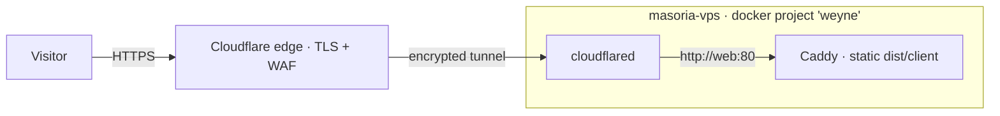
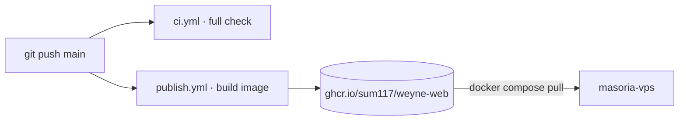

<div align="center">

# Weyne Representações

**Relacionamento, conhecimento e soluções que geram resultados.**

One-page marketing site for a commercial-representation business in professional
hygiene &amp; cleaning, serving Pernambuco, Alagoas, Paraíba and Rio Grande do Norte.

[](https://github.com/sum117/weyne-website/actions/workflows/ci.yml)
[](https://github.com/sum117/weyne-website/actions/workflows/publish.yml)
&nbsp;


</div>

---

## Overview

A production-grade landing page built as a **real route/document architecture** —
not a throwaway SPA. The `/` route is **statically prerendered** to HTML at build
time and hydrates only for menu, scroll, card interactions, motion, and the
WhatsApp lead form. The single conversion goal is to **start a WhatsApp
conversation**.

- ⚡ **Static-first** — prerendered HTML, hydrates progressively, works with JS disabled.
- 🎬 **Motion, done right** — scroll reveals, count-ups, parallax and hover states that are flicker-free, reduced-motion-safe, and no-JS safe.
- ♿ **Accessible** — semantic landmarks, focus management, keyboard/touch parity, `prefers-reduced-motion`.
- 🔎 **SEO-ready** — canonical URL, Open Graph/Twitter, an HTML-rendered OG image, `sitemap.xml`, `robots.txt`, and `Organization`/`ProfessionalService` JSON-LD.
- 🛡️ **Content gate** — a validation script fails a *release* build on any invented/placeholder contact data.

## Tech stack

| Concern | Choice |
|---|---|
| Framework | [TanStack Start](https://tanstack.com/start) (React 19, full-document SSR + static prerender) |
| Routing | TanStack Router (file-based) |
| Styling | Tailwind CSS **v4** (CSS-first `@theme`) + [CVA](https://cva.style) |
| UI primitives | shadcn/ui source components + Radix |
| Forms &amp; validation | TanStack Form + Zod (Standard Schema) |
| Motion | `motion` / `motion/react` with centralized house easing |
| Icons | Phosphor (`weight="light"`) |
| Fonts | Fontsource — Newsreader + Jost, self-hosted |
| Tooling | Bun · Vite 7 · ESLint · Vitest · Playwright |
| Delivery | Docker (Caddy static) · Cloudflare Tunnel · GHCR · GitHub Actions |

## Getting started

**Prerequisites:** [Bun](https://bun.sh) `1.3+`.

```bash
bun install
bun run dev            # http://localhost:3000
```

### Environment (optional)

All launch values have confirmed defaults in
[`src/features/landing/content.ts`](src/features/landing/content.ts). Override
only for a preview/staging origin via `VITE_*` (public values only — never put
secrets in a `VITE_` variable):

| Variable | Purpose | Default |
|---|---|---|
| `VITE_SITE_ORIGIN` | Canonical origin (no trailing slash) | `https://weynerepresentacoes.com.br` |
| `VITE_WHATSAPP_NUMBER` | Public WhatsApp number | `+55 (81) 99996-4054` |

## Scripts

| Script | What it does |
|---|---|
| `bun run dev` | Vite dev server |
| `bun run build` | `check:content` → prerendered production build |
| `bun run check` | Full gate: content → typecheck → lint → unit tests → build |
| `bun run test` / `test:watch` | Vitest unit tests |
| `bun run test:e2e` | Playwright end-to-end (run under Node) |
| `bun run check:content` | Content/launch-config validation (add `WEYNE_RELEASE=1` for the release gate) |
| `bun run serve:static` | Serve `dist/client` exactly as a static host would |
| `bun run generate:og` | Re-render the OG image from HTML |
| `bun run generate:icons` / `optimize:images` | Favicon &amp; image pipelines |

## Project structure

```text
src/
  routes/            __root.tsx (document shell) · index.tsx (/ + SEO head)
  features/landing/  content.ts (single source of copy + launch config)
                     content.schema.ts (integrity + release gates)
                     whatsapp.ts (wa.me URL contract)
                     components/ (sections, reveal, form)
  components/        site/ (nav, footer, floating actions) · ui/ (shadcn source)
  styles/app.css     Tailwind v4 @theme tokens, utilities, reveal CSS
scripts/             check-content · generate-og · generate-icons · serve-dist
deploy/              Caddyfile · docker-compose.weyne.yml · .env.weyne.example
public/              images, favicons, og/, robots.txt, sitemap.xml
```

## Content &amp; launch configuration

[`src/features/landing/content.ts`](src/features/landing/content.ts) is the **one
place** to edit copy and business values. Two validation tiers guard it:

- **Preview** (`bun run check:content`) — structural integrity is a hard error;
  unconfirmed contact data is a **warning**, so the pipeline stays green.
- **Release** (`WEYNE_RELEASE=1 bun run check:content`) — placeholders become
  **hard errors**, so a launch build can never ship invented data.

> **Still placeholder:** `CNPJ`. Instagram/LinkedIn are intentionally omitted
> (their icons don't render until URLs are supplied). Everything else — WhatsApp,
> e-mail, canonical origin, OG image — is confirmed.

## Deployment

The site is a static image served by Caddy, reached only through a **dedicated
Cloudflare Tunnel** — no public ports are opened on the host. It runs as an
**isolated Docker Compose project** (`weyne`) alongside, but fully independent
of, other stacks on the server.



**CI/CD**



- **`ci.yml`** runs the full gate on every push/PR.
- **`publish.yml`** builds the image and pushes `ghcr.io/sum117/weyne-web`
  tagged `:latest` and `:sha-<full-sha>`.

**One-time server setup**

```bash
# on masoria-vps
mkdir -p ~/weyne && cd ~/weyne
# copy deploy/docker-compose.weyne.yml and deploy/.env.weyne.example here
cp .env.weyne.example .env.weyne     # then set CLOUDFLARE_TUNNEL_TOKEN + IMAGE_TAG
docker compose --env-file .env.weyne pull
docker compose --env-file .env.weyne up -d
```

**Update to a new release** — set `IMAGE_TAG` to the new SHA in `.env.weyne`, then
`docker compose --env-file .env.weyne pull && ... up -d`. Rollback = previous SHA.

## SEO

Prerendered `<head>` includes title/description, canonical, Open Graph + Twitter
cards, and JSON-LD. `public/sitemap.xml` and `public/robots.txt` reference the
production origin. See [`docs/SEO.md`](docs/SEO.md) for the launch checklist
(Search Console verification, structured-data validation, Business Profile).

## Accessibility &amp; motion

Every animation degrades gracefully: reveals are hidden via CSS gated on a
pre-paint `data-js` flag (no flash-of-hidden-content, and everything is visible
with JavaScript disabled), and all motion collapses to instant under
`prefers-reduced-motion: reduce`.

## License

© 2026 Weyne Representações. All rights reserved. Source is public for
transparency and hosting; the brand, copy, and imagery are proprietary.

<div align="center"><sub>Built with care · TanStack Start + Tailwind v4</sub></div>
